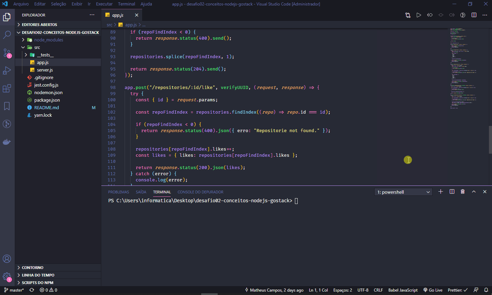

<h3 align="center">
  Desafio 02: Conceitos do Node.js
</h3>

<blockquote align="center">“Não espere para plantar, apenas tenha paciência para colher”!</blockquote>

  

  

---

## Demonstração:

## :rocket: Sobre o desafio

Essa é uma aplicação para armazenar repositórios do seu portfólio, que irá permitir a criação, listagem, atualização e remoção dos repositórios, e além disso permitir que os repositórios possam receber "likes".

---

Feito com 💜 by Teuuz1994 :wave:
